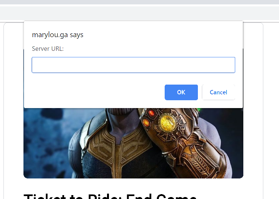
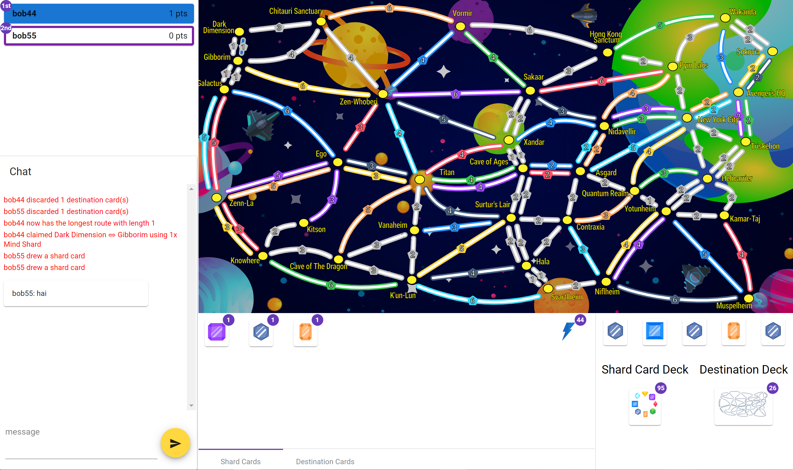
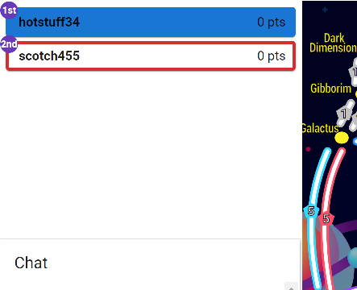
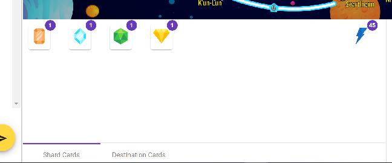
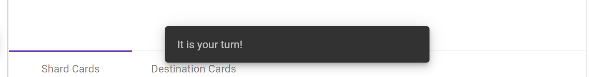
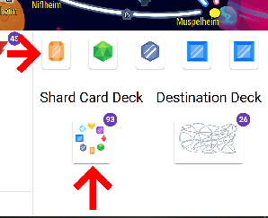
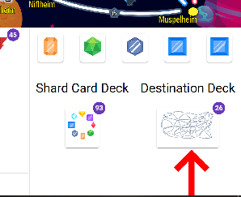
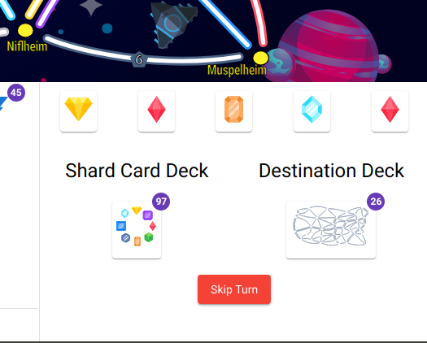

# Ticket to Ride - Infinity War Edition

## Accessing the Site
Open [marylou.ga](marylou.ga) on computer running Chrome. That should be it, unless something goes wrong. See [Troubleshooting](#troubleshooting) below.

## Troubleshooting
If the following instructions don't work, call the number given in contact.txt in the zip file

### Cannot communicate with Backend
The backend server (`api.marylou.ga`) should auto-restart if it crashes. The frontend (`marylou.ga`) shouldn't
ever crash, its just nginx serving static files.

If that doesn't work for some reason, run the provided `server.jar` using Java 8.

`java -jar server.jar`

It should print

```
On your marks... get set...
Server started on port 4300
Go!
```

1. Open `marylou.ga`
2. Press `u` on the keyboard, should open the "Server URL:" box
   
3. Enter `http://localhost:4300`

## Playing the Game

A brief explaination of how to use the game screen.

### Terminology

| Ticket to Ride Name | Ticket to Ride: End Game Name |
|---------------------|-------------------------------|
| Box Car             |	Reality Shard                 |
| Passenger	Car       | Soul Shard                    |
| Tanker Car          | Space Shard                   |
| Reefer Car          |	Mind Shard                    |
| Freight Car         | Power Shard                   |
| Hopper Car          | Time Shard                    |
| Coal Car            | Vibrainium                    |
| Caboose Car         | Palladium                     |
| Locomotive Car      | Infinity Gauntlet             |
| Route               | Jump (Gaurdians)              |
| Train Car (pieces)  | Jump Claiming Energy          |


### Player List


#### Who's turn is it?
The player who is colored in

#### What is the order?
The players are listed in turn order. The order that players choose their desination cards at the beginning of the game determines the turn order.

#### Who is winning?
See the badges

#### How do I see player stats?
Click on the palyer

### Player's Hand


#### What is the lightning bolt?
The number of trains ("jump claiming energy") the player has left

### Players Turn
You should see a toast when it is your turn



#### How do I claim a route?
Click on the route, then the Claim button will be enabled if it is possible. Choose what cards you want to use

#### How do I draw shard (train) cards?


Click on the shard card deck or one of the face up cards.

#### How do I draw destination cards?


Click on the destination card deck, and choose which cards you want to keep.

#### What if there aren't any cards left and I can't claim a route?


A red "Skip Turn" button should appear underneath the decks.

## Other Notes

- If you press 'm', the client will switch to manual polling mode. 'p' sends a poll
- You can rejoin a game if you reload the client. Since this isn't required and is implemented as a debugging aid, it isn't implemented very robustly, so don't file bugs
